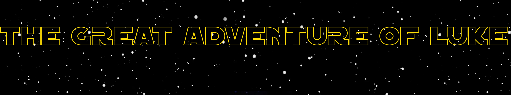

## TurtlePlatformer

Basic platformer written on a custom engine using tkinter as a graphics library

## Currently implemented engine features:

##_Renderer_
---
- supports sprite layering
- implements basic camera functionality
---
## _Phys engine_
---
- basic collision detection and handling using square hitboxes
- velocities and gravity simulation
- allows user to use multithreading
---
## _Picture and animation loader_
---
- can be instantiated multiple times to allow for unloading only some assets. (e.g one instance for the player that does not get unloaded between levels)
- caches all pictures and their descriptors
---
## _Sound engine_
---
- a basic winapi wrapper to play mp3's and wav sounds
- used since python has no built-in music lib
---
## _Collider_drawer_
---
-a tool to draw colliders

## Contributors

- Oleg Shkurenko(nocommas555)
- Vladyslav Kravchenko(cyberlord-coder-228)
- Kyrylo Cholombytko(1mperix)

## Special thanks

- Timur Shemsedinov